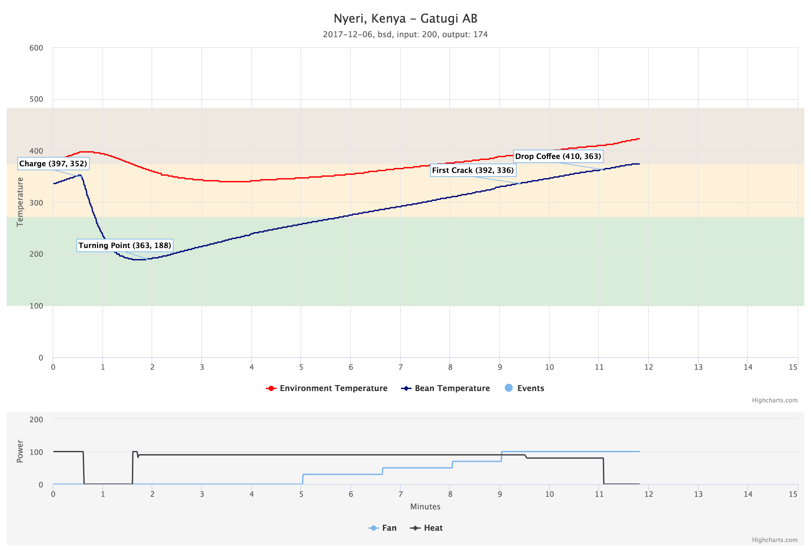

Split Key Roast
===============

Split Key Roast is a platform to manage green coffee, refine roasting profiles and perform roasting through the web. Anyone can run the platform on their system and quickly get up and running. The goal of the project is to make home roasting more accessible through sharing data and easing the overall process.

Supported roasters:

* Hottop KN-8828b-2k+ (pyhottop_)

.. _pyhottop: https://github.com/splitkeycoffee/pyhottop

Getting Started
---------------
Checkout this project, change directories and create a new virtual environment for Python:

    $ virtualenv -p /usr/bin/python2.7 venv

Activate your venv:

    $ source venv/bin/activate

Install the requirements via pip:

    $ pip install -r requirements.txt

Run an instance of redis server in another terminal tab:

    $ redis-server

Run the application locally:

    $ sudo python server.py

Access localhost from within the browser:

    http://127.0.0.1

Features
--------
* Basic user administration
* Inventory manager for green coffee
* Roast interface to perform live-roasts
* Automatic tracking of historic roasts
* Visual roast graphics showing charts and statistics
* Export options for roast graphs and log information
* Roast profile manager

Support
-------
Split Key Roast is maintained by Brandon Dixon (9b). Any questions, comments or issues should be sent in through our Github issues_ page. For more documentation, see our wiki_.

.. _9b: https://github.com/9b
.. _issues: https://github.com/splitkeycoffee/split-key-roast/issues
.. _wiki: https://github.com/splitkeycoffee/split-key-roast/wiki